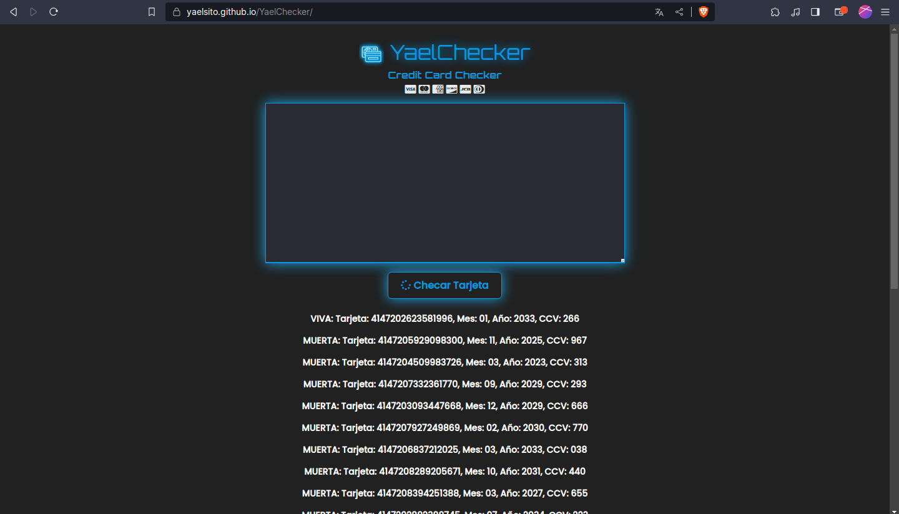
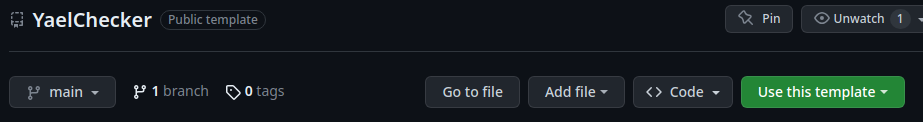
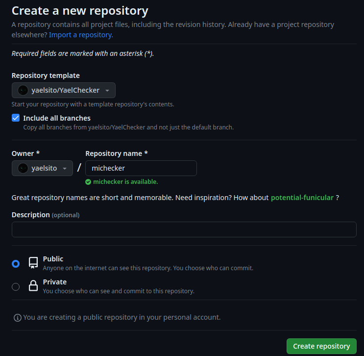
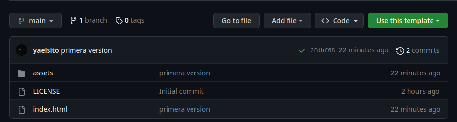
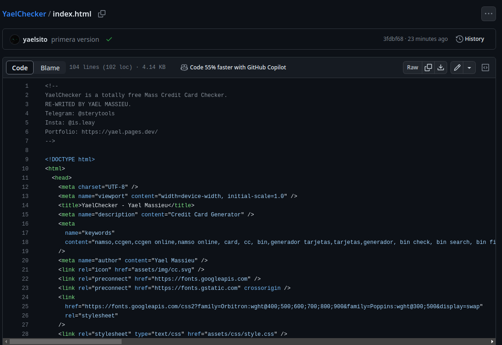
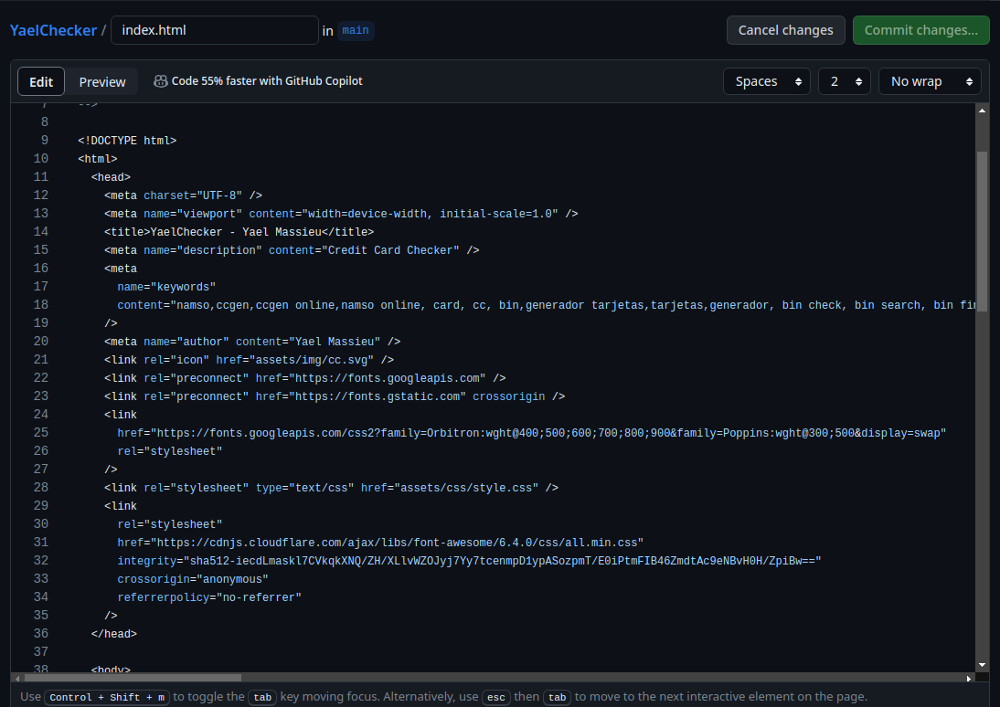
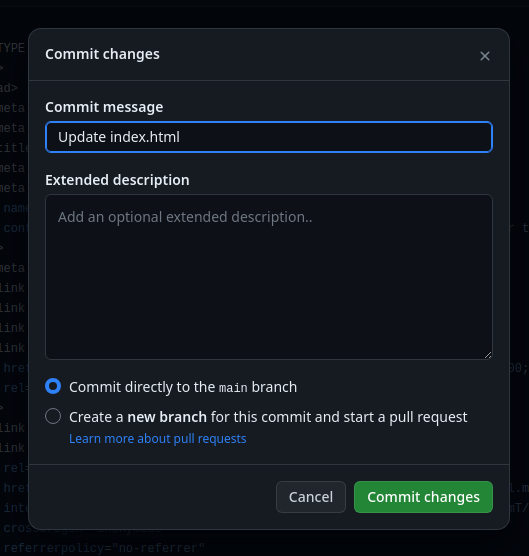
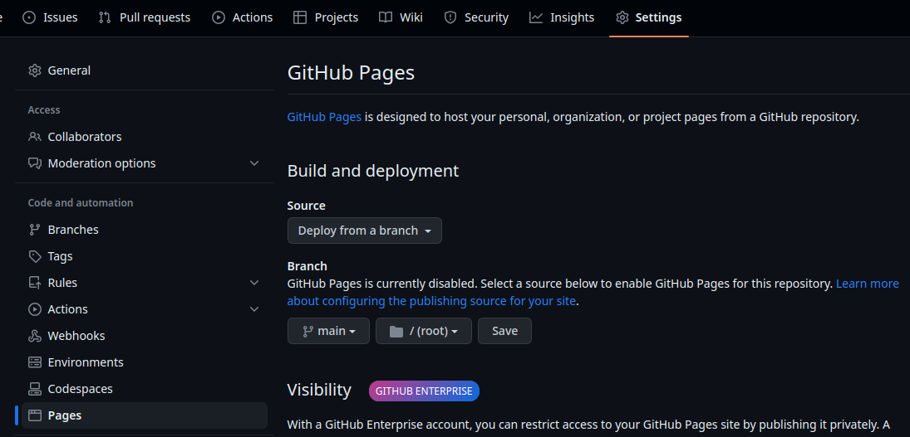
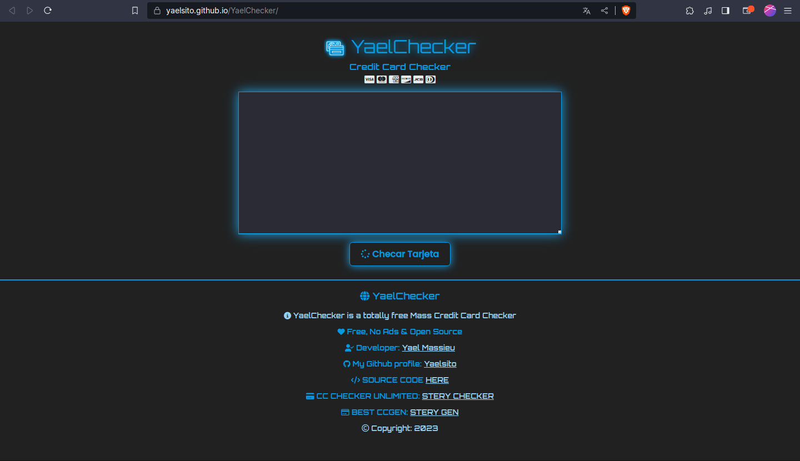

# BIENVENIDO A YAELCHECKER

Con YAELCHECKER podrás tener tu propio generador de tarjetas personalizado y online con **Github Pages.**

## PREVIEW de como quedaría:

# TUTORIAL

¿No tienes experiencia en programación? No importa, es sencillo. Primero debes crear tu cuenta de Github. Simplemente registrate en "Signup".

## 1. Usar la plantilla

Selecciona el botón verde "Use this template".

## 2. Configurar el nuevo repositorio

Te mostrará una ventana donde:
  - **Repository name:** será el nuevo nombre de tu repositorio. Ojo: No será el mismo nombre de tu CHECKER pero puedes usarlo.
  - **Include all branches:** garantiza que si en el futuro agrego cosas nuevas, podrás acceder a ellas. Debes marcar la casilla.

Luego, debes darle ***"Create repository from template".***

# 3. Personalización

Ahora verás una pantalla con todos los nuevos archivos del generador, entre ellos: `index.html`
Toca **index.html** y espera que cargue.

Una vez haya cargado, toca el icono del Lapiz para editar el archivo:

## MODIFICAR INDEX.HTML

Ahora verás todas las lineas que conforman el CHECKER.
Recuerda solo editar las cosas que estén dentro del **cuadro rojo y solo como se observa en el ejemplo.**

 - **La línea 14:** Te permite darle un nombre a tu CHECKER, es el que se mostrará en la pestaña del navegador.
   
-   **La línea 15:** Te permite ponerle una descripción a tu CHECKER, la que se mostrará en los buscadores.
   
 -  **La línea 20:** Es para poner tu nombre como autor del CHECKER o bien podrías dejarlo así, no pasa nada.
   
  - **La línea 41:** Te permite darle nombre a tu CHECKER, es el nombre que se mostrará en la página principal y el más importante.
   
   - **La línea 43:** Te permite darle una descripción corta a tu CHECKER, ya sea un eslogan, una frase o algo. se mostrará igual en la página
   principal.

## ACTUALIZAR INDEX.HTML

Ya que hayas terminado de editar a tu gusto, ve hasta abajo de la página y dale al botón verde que dice **"Commit changes"**

> **Nota:** No debes **modificar** ninguna otra cosa, porque puedes dejar inservible tu generador y deberás repetir el proceso.

# PONER ONLINE TU CHECKER

Ya casi hemos terminado, ahora toca poner online tu nuevo CHECKER.  Para eso debes ir a "Settings" en la parte superior.

Ahora dirigete a "Pages" y aquí debes configurar lo siguiente:

 - **Source:** `Deploy from a branch`.
 - 
   **Branch:** `Main`.
 -  
   **Carpeta:** `root` (dejar por defecto luego de elegir `main`).

**Ahora debes darle "SAVE" y esperar.**
Adjunto imagen de cómo debe quedar:

## OBTENER LA URL DE TU CHECKER
Si ya hiciste lo anterior, ahora refresca la página y verás lo siguiente:

> Ahora solo toca el botón **"Visit Site"** y te llevará a tu nuevo
> CHECKER personalizado. Procura guardar ese link en un blog de notas o
> guardarlo como Favorito en tu navegador.

# RESULTADO FINAL
Si has hecho bien todos los pasos, verás este bonito CHECKER personalizado con todos tus datos!

